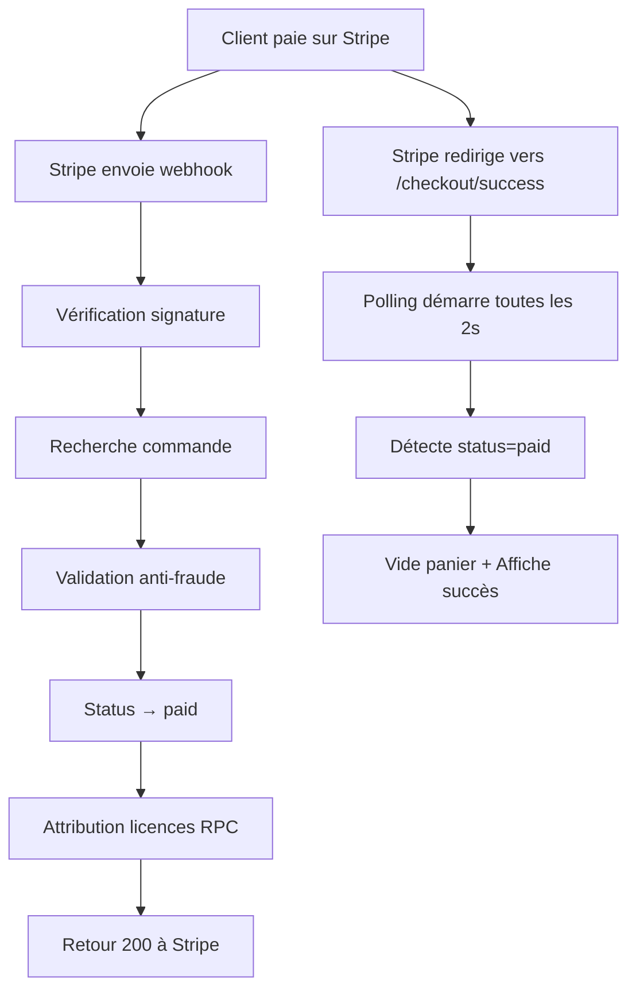

# 🚀 Système de Webhook Stripe avec Attribution de Licences

## 📋 Vue d'ensemble

Ce système automatise complètement le processus de paiement et d'attribution de licences :

1. **Client paie** → Stripe redirige vers `/checkout/success`
2. **Stripe envoie webhook** → `/api/webhook/stripe`
3. **Webhook valide** → Marque commande `paid` + Attribue licences
4. **Page success** → Polling détecte `paid` → Vide le panier → Affiche succès

---

## 🗄️ Base de données Supabase

### 1. Créer la fonction RPC

Exécutez le SQL suivant dans l'éditeur SQL de Supabase :

```sql
-- Fichier: supabase/functions/assign_licenses.sql

CREATE OR REPLACE FUNCTION assign_licenses_to_order(
  p_order_id UUID,
  p_product_id TEXT,
  p_quantity INTEGER
)
RETURNS INTEGER
LANGUAGE plpgsql
SECURITY DEFINER
AS $$
DECLARE
  v_assigned_count INTEGER;
BEGIN
  RAISE NOTICE '[ASSIGN_LICENSES] Order: %, Product: %, Quantity: %', 
    p_order_id, p_product_id, p_quantity;

  WITH available_licenses AS (
    SELECT id
    FROM licenses
    WHERE product_id = p_product_id
      AND is_used = false
      AND order_id IS NULL
    ORDER BY created_at ASC
    LIMIT p_quantity
    FOR UPDATE SKIP LOCKED
  ),
  updated_licenses AS (
    UPDATE licenses
    SET 
      is_used = true,
      order_id = p_order_id,
      updated_at = NOW()
    WHERE id IN (SELECT id FROM available_licenses)
    RETURNING id
  )
  SELECT COUNT(*) INTO v_assigned_count
  FROM updated_licenses;

  RAISE NOTICE '[ASSIGN_LICENSES] Assigned % licenses for order %', 
    v_assigned_count, p_order_id;

  RETURN v_assigned_count;
END;
$$;

REVOKE ALL ON FUNCTION assign_licenses_to_order FROM PUBLIC;
GRANT EXECUTE ON FUNCTION assign_licenses_to_order TO service_role;
```

### 2. Vérifier la structure de la table `licenses`

Assurez-vous que votre table `licenses` a cette structure :

```sql
CREATE TABLE licenses (
  id UUID PRIMARY KEY DEFAULT uuid_generate_v4(),
  product_id TEXT NOT NULL REFERENCES products(slug),
  key_code TEXT NOT NULL UNIQUE,  -- ⚠️ Nom exact de la colonne
  is_used BOOLEAN DEFAULT false,
  order_id UUID REFERENCES orders(id),
  created_at TIMESTAMPTZ DEFAULT NOW(),
  updated_at TIMESTAMPTZ DEFAULT NOW()
);

-- Index pour performance
CREATE INDEX idx_licenses_available ON licenses(product_id, is_used, created_at)
WHERE is_used = false;
```

### 3. Ajouter des licences de test

```sql
-- Exemple : Ajouter 10 licences pour Windows 11 Pro
INSERT INTO licenses (product_id, key_code, is_used)
VALUES 
  ('win-11-pro', 'XXXXX-XXXXX-XXXXX-XXXXX-XXXXX', false),
  ('win-11-pro', 'YYYYY-YYYYY-YYYYY-YYYYY-YYYYY', false),
  ('win-11-pro', 'ZZZZZ-ZZZZZ-ZZZZZ-ZZZZZ-ZZZZZ', false);
  -- ... répétez pour avoir un stock
```

---

## ⚙️ Configuration

### Variables d'environnement (`.env.local`)

```bash
# Supabase
NEXT_PUBLIC_SUPABASE_URL=https://xxx.supabase.co
NEXT_PUBLIC_SUPABASE_ANON_KEY=eyJ...
SUPABASE_SERVICE_ROLE_KEY=eyJ...  # ⚠️ CRITIQUE pour webhook

# Stripe
NEXT_PUBLIC_STRIPE_PUBLISHABLE_KEY=pk_test_...
STRIPE_SECRET_KEY=sk_test_...
STRIPE_WEBHOOK_SECRET=whsec_...  # ⚠️ Obtenu via Stripe CLI ou Dashboard

# Application
NEXT_PUBLIC_APP_URL=http://localhost:3000
```

---

## 🧪 Test en LOCAL

### 1. Lancer le serveur Next.js

```bash
cd frontend
npm run dev
```

### 2. Lancer Stripe CLI (OBLIGATOIRE)

```bash
cd frontend
.\stripe.exe login  # Authentification (une seule fois)
.\stripe.exe listen --forward-to localhost:3000/api/webhook/stripe
```

**Important** : Copiez le `whsec_...` affiché et mettez-le dans `.env.local` comme `STRIPE_WEBHOOK_SECRET`.

### 3. Tester un paiement complet

1. Allez sur `http://localhost:3000`
2. Ajoutez un produit au panier
3. Allez sur `/checkout`
4. Entrez un email
5. Payez avec la carte test : `4242 4242 4242 4242`
6. **Attendez** la redirection automatique

### 4. Vérifier les logs

**Terminal Stripe CLI** :
```
checkout.session.completed [evt_xxx]
  POST http://localhost:3000/api/webhook/stripe [200]
```

**Terminal Next.js** :
```
[WEBHOOK] ✅ Signature Stripe validée
[WEBHOOK] ✅ Commande trouvée
[WEBHOOK] ✅ Status mis à jour → PAID
[WEBHOOK] 🔑 === DÉBUT ATTRIBUTION LICENCES ===
[WEBHOOK] ✅ Licences attribuées: 1
[WEBHOOK] ✅ ✅ ✅ WEBHOOK TERMINÉ AVEC SUCCÈS
```

**Navigateur** :
- Page passe automatiquement à "Paiement confirmé !"
- Panier vidé

**Supabase** :
```sql
-- Vérifier la commande
SELECT * FROM orders WHERE status = 'paid';

-- Vérifier les licences attribuées
SELECT * FROM licenses WHERE is_used = true;
```

---

## 🚀 Déploiement en PRODUCTION

### 1. Configurer le webhook dans Stripe Dashboard

1. Allez sur https://dashboard.stripe.com/webhooks
2. Cliquez "Add endpoint"
3. URL : `https://votre-domaine.com/api/webhook/stripe`
4. Événements à écouter : `checkout.session.completed`
5. **Copiez le "Signing secret"** (commence par `whsec_`)

### 2. Variables d'environnement de production

Dans Vercel/Netlify/etc., ajoutez :

```bash
STRIPE_WEBHOOK_SECRET=whsec_xxx  # ⚠️ Secret du webhook de PRODUCTION
STRIPE_SECRET_KEY=sk_live_...    # ⚠️ Clé LIVE (pas test)
NEXT_PUBLIC_STRIPE_PUBLISHABLE_KEY=pk_live_...  # ⚠️ Clé publique LIVE
```

### 3. Tester en production

Utilisez une vraie carte de test Stripe (même en mode Live) ou basculez en mode Test dans le Dashboard.

---

## 🔒 Sécurité

### Validations anti-fraude

Le webhook vérifie :

1. ✅ **Signature Stripe** : Garantit que la requête vient bien de Stripe
2. ✅ **session.id = order.stripe_session_id** : Empêche les attaques replay
3. ✅ **Status = pending** : Évite les doubles paiements
4. ✅ **Idempotence** : Si déjà `paid`, retourne 200 sans rien faire

### Gestion de la concurrence

- La fonction RPC utilise **`FOR UPDATE SKIP LOCKED`** pour garantir qu'une licence ne peut être attribuée qu'une seule fois
- Même si 2 webhooks arrivent simultanément, aucune licence ne sera attribuée deux fois

### Gestion du stock insuffisant

Si pas assez de licences disponibles :
- Le webhook log `[WEBHOOK] OUT_OF_STOCK`
- Retourne 200 à Stripe (pas d'erreur)
- Attribut les licences disponibles (partiel)
- Vous pouvez ensuite gérer manuellement le client

---

## 📊 Logs et Monitoring

### Logs serveur

Tous préfixés par `[WEBHOOK]` pour faciliter le filtering :

```
[WEBHOOK] 🎯 === DÉBUT WEBHOOK STRIPE ===
[WEBHOOK] ✅ Signature Stripe validée
[WEBHOOK] 🔍 Recherche commande...
[WEBHOOK] ✅ Commande trouvée par stripe_session_id
[WEBHOOK] 💾 Mise à jour status → paid...
[WEBHOOK] 🔑 === DÉBUT ATTRIBUTION LICENCES ===
[WEBHOOK] ✅ Licences attribuées: 2
[WEBHOOK] ✅ ✅ ✅ WEBHOOK TERMINÉ AVEC SUCCÈS
```

### Erreurs possibles

| Erreur | Cause | Solution |
|--------|-------|----------|
| `COMMANDE INTROUVABLE` | Session ID invalide ou commande supprimée | Vérifier Supabase |
| `TENTATIVE DE FRAUDE DÉTECTÉE` | session.id ≠ order.stripe_session_id | Vérifier les métadonnées Stripe |
| `STOCK INSUFFISANT` | Pas assez de licences `is_used=false` | Ajouter des licences |
| `Erreur RPC assign_licenses_to_order` | Fonction SQL non créée | Exécuter le SQL de création |

---

## 🎯 Workflow complet



---

## 🔧 Dépannage

### Le webhook ne reçoit rien en local

- ✅ Vérifier que Stripe CLI est lancé : `.\stripe.exe listen --forward-to localhost:3000/api/webhook/stripe`
- ✅ Vérifier que vous êtes authentifié : `.\stripe.exe login`
- ✅ Vérifier que le bon compte Stripe est utilisé (clés API correspondantes)

### La commande reste en `pending`

- ✅ Vérifier les logs du terminal Next.js (webhook exécuté ?)
- ✅ Vérifier les logs Stripe CLI (événement reçu ?)
- ✅ Vérifier `STRIPE_WEBHOOK_SECRET` dans `.env.local`

### Aucune licence attribuée

- ✅ Vérifier que la fonction RPC existe : `SELECT assign_licenses_to_order(...)` dans SQL Editor
- ✅ Vérifier qu'il y a des licences : `SELECT * FROM licenses WHERE is_used = false`
- ✅ Vérifier les logs : `[WEBHOOK] Erreur RPC`

---

## ✅ Checklist de mise en production

- [ ] Fonction SQL `assign_licenses_to_order` créée dans Supabase
- [ ] Table `licenses` avec colonnes `id, product_id, key_code, is_used, order_id`
- [ ] Stock de licences ajouté pour chaque produit
- [ ] Webhook configuré dans Stripe Dashboard (mode LIVE)
- [ ] Variables d'environnement de production configurées
- [ ] Test avec carte Stripe en mode Live
- [ ] Monitoring des logs webhook (Vercel Logs, Sentry, etc.)
- [ ] Plan de gestion du stock insuffisant (alertes, rechargement auto)

---

🎉 **Votre système est maintenant prêt pour la production !**
